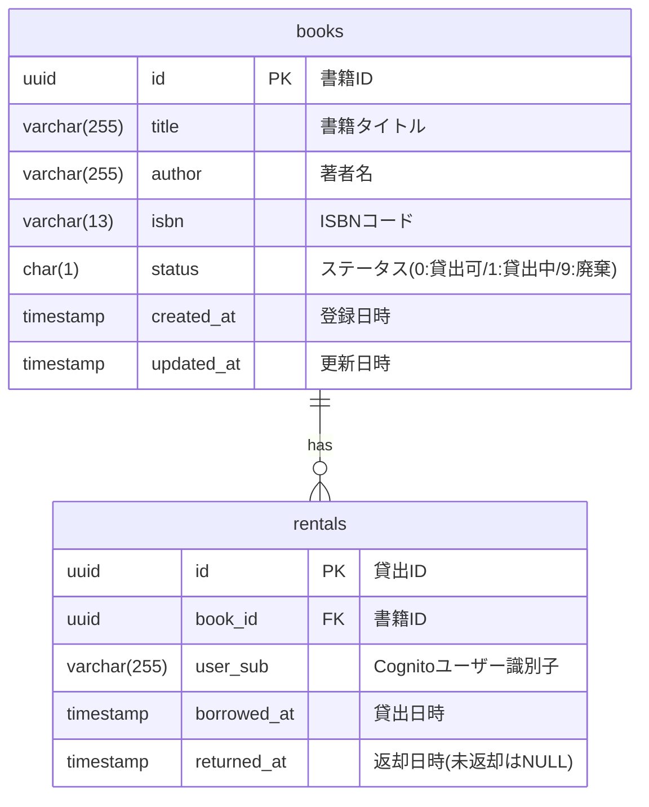

# データベース設計書

本ドキュメントでは、蔵書管理システムのデータベース設計を定義します。

## 1. 概要

### 1.1 データベース情報

| 項目 | 値 |
|------|-----|
| DBMS | Amazon RDS for PostgreSQL |
| バージョン | PostgreSQL 15.x |
| 文字コード | UTF-8 |
| 照合順序 | ja_JP.UTF-8 |

### 1.2 命名規則

- テーブル名: 小文字スネークケース、複数形（例: `books`, `rentals`）
- カラム名: 小文字スネークケース（例: `created_at`, `book_id`）
- 主キー: `id`
- 外部キー: `{参照テーブル単数形}_id`（例: `book_id`）
- インデックス: `idx_{テーブル名}_{カラム名}`
- 制約: `{テーブル名}_{制約種別}_{カラム名}`

---

## 2. ER図



---

## 3. テーブル定義

### 3.1 books（書籍）

書籍の基本情報を管理するテーブル。

#### カラム定義

| カラム名 | データ型 | NULL | デフォルト | 説明 |
|----------|----------|------|------------|------|
| id | UUID | NOT NULL | gen_random_uuid() | 主キー |
| title | VARCHAR(255) | NOT NULL | - | 書籍タイトル |
| author | VARCHAR(255) | NOT NULL | - | 著者名 |
| isbn | VARCHAR(13) | NULL | NULL | ISBNコード（10桁/13桁） |
| status | CHAR(1) | NOT NULL | '0' | ステータス |
| created_at | TIMESTAMP WITH TIME ZONE | NOT NULL | CURRENT_TIMESTAMP | 登録日時 |
| updated_at | TIMESTAMP WITH TIME ZONE | NOT NULL | CURRENT_TIMESTAMP | 更新日時 |

#### ステータス値

| 値 | 説明 |
|----|------|
| 0 | 貸出可能 |
| 1 | 貸出中 |
| 9 | 廃棄 |

#### インデックス

| インデックス名 | カラム | 種別 | 説明 |
|----------------|--------|------|------|
| books_pkey | id | PRIMARY KEY | 主キー |
| idx_books_status | status | BTREE | ステータス検索用 |
| idx_books_title | title | BTREE | タイトル検索用 |
| idx_books_author | author | BTREE | 著者検索用 |
| idx_books_isbn | isbn | BTREE | ISBN検索用（ユニーク制約なし） |

#### DDL

```sql
CREATE TABLE books (
    id UUID PRIMARY KEY DEFAULT gen_random_uuid(),
    title VARCHAR(255) NOT NULL,
    author VARCHAR(255) NOT NULL,
    isbn VARCHAR(13),
    status CHAR(1) NOT NULL DEFAULT '0',
    created_at TIMESTAMP WITH TIME ZONE NOT NULL DEFAULT CURRENT_TIMESTAMP,
    updated_at TIMESTAMP WITH TIME ZONE NOT NULL DEFAULT CURRENT_TIMESTAMP,

    CONSTRAINT books_status_check CHECK (status IN ('0', '1', '9'))
);

CREATE INDEX idx_books_status ON books (status);
CREATE INDEX idx_books_title ON books (title);
CREATE INDEX idx_books_author ON books (author);
CREATE INDEX idx_books_isbn ON books (isbn);

COMMENT ON TABLE books IS '書籍マスタ';
COMMENT ON COLUMN books.id IS '書籍ID';
COMMENT ON COLUMN books.title IS '書籍タイトル';
COMMENT ON COLUMN books.author IS '著者名';
COMMENT ON COLUMN books.isbn IS 'ISBNコード';
COMMENT ON COLUMN books.status IS 'ステータス（0:貸出可, 1:貸出中, 9:廃棄）';
COMMENT ON COLUMN books.created_at IS '登録日時';
COMMENT ON COLUMN books.updated_at IS '更新日時';
```

---

### 3.2 rentals（貸出履歴）

書籍の貸出・返却履歴を管理するテーブル。

#### カラム定義

| カラム名 | データ型 | NULL | デフォルト | 説明 |
|----------|----------|------|------------|------|
| id | UUID | NOT NULL | gen_random_uuid() | 主キー |
| book_id | UUID | NOT NULL | - | 書籍ID（外部キー） |
| user_sub | VARCHAR(255) | NOT NULL | - | Cognito ユーザー識別子 |
| borrowed_at | TIMESTAMP WITH TIME ZONE | NOT NULL | CURRENT_TIMESTAMP | 貸出日時 |
| returned_at | TIMESTAMP WITH TIME ZONE | NULL | NULL | 返却日時（未返却はNULL） |

#### インデックス

| インデックス名 | カラム | 種別 | 説明 |
|----------------|--------|------|------|
| rentals_pkey | id | PRIMARY KEY | 主キー |
| idx_rentals_book_id | book_id | BTREE | 書籍ID検索用 |
| idx_rentals_user_sub | user_sub | BTREE | ユーザー検索用 |
| idx_rentals_borrowed_at | borrowed_at | BTREE | 貸出日時検索用 |
| idx_rentals_active | book_id, returned_at | BTREE | 貸出中検索用（部分インデックス） |

#### 外部キー制約

| 制約名 | 参照先 | ON DELETE | ON UPDATE |
|--------|--------|-----------|-----------|
| rentals_book_id_fkey | books(id) | RESTRICT | CASCADE |

#### DDL

```sql
CREATE TABLE rentals (
    id UUID PRIMARY KEY DEFAULT gen_random_uuid(),
    book_id UUID NOT NULL,
    user_sub VARCHAR(255) NOT NULL,
    borrowed_at TIMESTAMP WITH TIME ZONE NOT NULL DEFAULT CURRENT_TIMESTAMP,
    returned_at TIMESTAMP WITH TIME ZONE,

    CONSTRAINT rentals_book_id_fkey FOREIGN KEY (book_id)
        REFERENCES books(id) ON DELETE RESTRICT ON UPDATE CASCADE
);

CREATE INDEX idx_rentals_book_id ON rentals (book_id);
CREATE INDEX idx_rentals_user_sub ON rentals (user_sub);
CREATE INDEX idx_rentals_borrowed_at ON rentals (borrowed_at);
CREATE INDEX idx_rentals_active ON rentals (book_id) WHERE returned_at IS NULL;

COMMENT ON TABLE rentals IS '貸出履歴';
COMMENT ON COLUMN rentals.id IS '貸出ID';
COMMENT ON COLUMN rentals.book_id IS '書籍ID';
COMMENT ON COLUMN rentals.user_sub IS 'Cognitoユーザー識別子（sub）';
COMMENT ON COLUMN rentals.borrowed_at IS '貸出日時';
COMMENT ON COLUMN rentals.returned_at IS '返却日時（未返却はNULL）';
```

---

## 4. データ整合性ルール

### 4.1 貸出時の制約

1. 書籍のステータスが `0`（貸出可）の場合のみ貸出可能
2. 貸出登録と同時に書籍ステータスを `1`（貸出中）に更新
3. 同一書籍の重複貸出を防ぐ（排他制御）

### 4.2 返却時の制約

1. `returned_at` が NULL の貸出記録のみ返却可能
2. 返却登録と同時に書籍ステータスを `0`（貸出可）に更新
3. 自分の貸出記録のみ返却可能（管理者は全員可）

### 4.3 削除時の制約

1. 貸出中（ステータス `1`）の書籍は削除不可
2. 書籍削除は論理削除（ステータスを `9` に変更）

---

## 5. マイグレーション

### 5.1 初期スキーマ作成

```sql
-- Migration: 001_create_books_table.sql
CREATE TABLE books (
    id UUID PRIMARY KEY DEFAULT gen_random_uuid(),
    title VARCHAR(255) NOT NULL,
    author VARCHAR(255) NOT NULL,
    isbn VARCHAR(13),
    status CHAR(1) NOT NULL DEFAULT '0',
    created_at TIMESTAMP WITH TIME ZONE NOT NULL DEFAULT CURRENT_TIMESTAMP,
    updated_at TIMESTAMP WITH TIME ZONE NOT NULL DEFAULT CURRENT_TIMESTAMP,
    CONSTRAINT books_status_check CHECK (status IN ('0', '1', '9'))
);

CREATE INDEX idx_books_status ON books (status);
CREATE INDEX idx_books_title ON books (title);
CREATE INDEX idx_books_author ON books (author);
CREATE INDEX idx_books_isbn ON books (isbn);
```

```sql
-- Migration: 002_create_rentals_table.sql
CREATE TABLE rentals (
    id UUID PRIMARY KEY DEFAULT gen_random_uuid(),
    book_id UUID NOT NULL,
    user_sub VARCHAR(255) NOT NULL,
    borrowed_at TIMESTAMP WITH TIME ZONE NOT NULL DEFAULT CURRENT_TIMESTAMP,
    returned_at TIMESTAMP WITH TIME ZONE,
    CONSTRAINT rentals_book_id_fkey FOREIGN KEY (book_id)
        REFERENCES books(id) ON DELETE RESTRICT ON UPDATE CASCADE
);

CREATE INDEX idx_rentals_book_id ON rentals (book_id);
CREATE INDEX idx_rentals_user_sub ON rentals (user_sub);
CREATE INDEX idx_rentals_borrowed_at ON rentals (borrowed_at);
CREATE INDEX idx_rentals_active ON rentals (book_id) WHERE returned_at IS NULL;
```

### 5.2 updated_at 自動更新トリガー

```sql
-- Migration: 003_create_updated_at_trigger.sql
CREATE OR REPLACE FUNCTION update_updated_at_column()
RETURNS TRIGGER AS $$
BEGIN
    NEW.updated_at = CURRENT_TIMESTAMP;
    RETURN NEW;
END;
$$ language 'plpgsql';

CREATE TRIGGER update_books_updated_at
    BEFORE UPDATE ON books
    FOR EACH ROW
    EXECUTE FUNCTION update_updated_at_column();
```

---

## 6. サンプルデータ

```sql
-- 書籍サンプルデータ
INSERT INTO books (title, author, isbn, status) VALUES
    ('リーダブルコード', 'Dustin Boswell', '9784873115658', '0'),
    ('Clean Code', 'Robert C. Martin', '9780132350884', '0'),
    ('リファクタリング', 'Martin Fowler', '9784274224546', '1'),
    ('ドメイン駆動設計', 'Eric Evans', '9784798121963', '0');

-- 貸出サンプルデータ（リファクタリングが貸出中）
INSERT INTO rentals (book_id, user_sub, borrowed_at) VALUES
    (
        (SELECT id FROM books WHERE title = 'リファクタリング'),
        'sample-user-sub-12345',
        '2024-01-20 14:00:00+09'
    );
```

---

## 7. バックアップ・リストア

### 7.1 バックアップ戦略

| 項目 | 設定 |
|------|------|
| 自動バックアップ | 有効（7日間保持） |
| バックアップウィンドウ | 03:00-04:00 JST |
| スナップショット | 手動（デプロイ前） |

### 7.2 リストア手順

```bash
# RDSスナップショットからリストア
aws rds restore-db-instance-from-db-snapshot \
    --db-instance-identifier zousho-db-restored \
    --db-snapshot-identifier zousho-db-snapshot-YYYYMMDD
```
