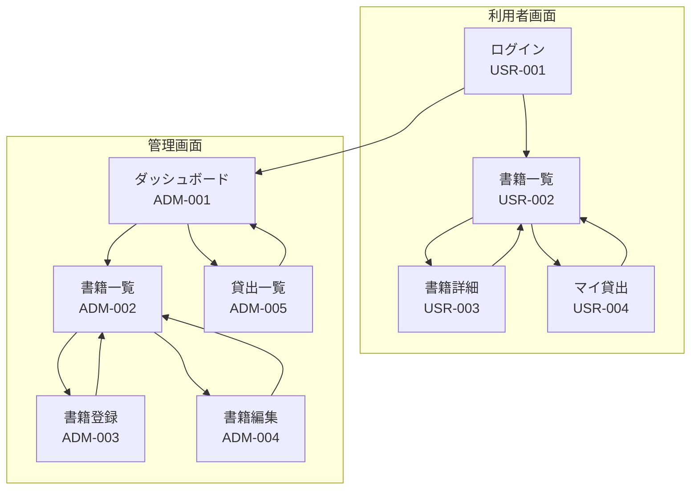

# 画面設計書

本ドキュメントでは、蔵書管理システムの画面設計を定義します。

## 1. 画面一覧

### 1.1 利用者画面 (User)

| No | 画面ID | 画面名 | URL | 説明 |
|----|--------|--------|-----|------|
| 1 | USR-001 | ログイン | /login | ユーザー認証 |
| 2 | USR-002 | 書籍一覧 | /books | 書籍の検索・一覧表示 |
| 3 | USR-003 | 書籍詳細 | /books/:id | 書籍の詳細情報 |
| 4 | USR-004 | マイ貸出 | /my-rentals | 自分の貸出履歴 |

### 1.2 管理画面 (Admin)

| No | 画面ID | 画面名 | URL | 説明 |
|----|--------|--------|-----|------|
| 1 | ADM-001 | ダッシュボード | /admin | 統計情報表示 |
| 2 | ADM-002 | 書籍一覧 | /admin/books | 書籍のCRUD管理 |
| 3 | ADM-003 | 書籍登録 | /admin/books/create | 新規書籍登録 |
| 4 | ADM-004 | 書籍編集 | /admin/books/:id | 書籍情報編集 |
| 5 | ADM-005 | 貸出一覧 | /admin/rentals | 全貸出履歴管理 |

---

## 2. 画面遷移図



---

## 3. 利用者画面設計

### 3.1 USR-001: ログイン画面

#### ワイヤーフレーム

```
┌──────────────────────────────────────────────────┐
│                    蔵書管理システム                │
├──────────────────────────────────────────────────┤
│                                                  │
│         ┌────────────────────────────┐           │
│         │         ログイン           │           │
│         ├────────────────────────────┤           │
│         │                            │           │
│         │  メールアドレス            │           │
│         │  ┌────────────────────┐    │           │
│         │  │                    │    │           │
│         │  └────────────────────┘    │           │
│         │                            │           │
│         │  パスワード                │           │
│         │  ┌────────────────────┐    │           │
│         │  │ ********           │    │           │
│         │  └────────────────────┘    │           │
│         │                            │           │
│         │  ┌────────────────────┐    │           │
│         │  │     ログイン       │    │           │
│         │  └────────────────────┘    │           │
│         │                            │           │
│         │  パスワードを忘れた方      │           │
│         │                            │           │
│         └────────────────────────────┘           │
│                                                  │
└──────────────────────────────────────────────────┘
```

#### 画面項目

| No | 項目名 | 種類 | 必須 | 説明 |
|----|--------|------|------|------|
| 1 | メールアドレス | テキスト入力 | Yes | Cognito登録メールアドレス |
| 2 | パスワード | パスワード入力 | Yes | ログインパスワード |
| 3 | ログインボタン | ボタン | - | 認証実行 |
| 4 | パスワードリセットリンク | リンク | - | パスワードリセット画面へ |

#### 動作仕様

| イベント | 動作 |
|----------|------|
| ログインボタン押下 | Cognito認証実行。成功時は書籍一覧へ遷移 |
| 認証失敗 | エラーメッセージ表示（「メールアドレスまたはパスワードが正しくありません」） |

---

### 3.2 USR-002: 書籍一覧画面

#### ワイヤーフレーム

```
┌──────────────────────────────────────────────────────────────┐
│ 蔵書管理システム                    [マイ貸出] [ログアウト]  │
├──────────────────────────────────────────────────────────────┤
│                                                              │
│  書籍一覧                                                    │
│  ─────────────────────────────────────────────────────────   │
│                                                              │
│  ┌─────────────────────────────────────┐ ┌───────────────┐   │
│  │ 検索...                             │ │ すべて ▼      │   │
│  └─────────────────────────────────────┘ └───────────────┘   │
│                                                              │
│  ┌────────────────────────────────────────────────────────┐  │
│  │ タイトル        │ 著者           │ ステータス │ 操作   │  │
│  ├────────────────────────────────────────────────────────┤  │
│  │ リーダブルコード│ Dustin Boswell │ ■ 貸出可   │ [借りる]│ │
│  ├────────────────────────────────────────────────────────┤  │
│  │ Clean Code      │ Robert Martin  │ □ 貸出中   │ [詳細] │  │
│  ├────────────────────────────────────────────────────────┤  │
│  │ リファクタリング│ Martin Fowler  │ ■ 貸出可   │ [借りる]│ │
│  └────────────────────────────────────────────────────────┘  │
│                                                              │
│  ◀ 1 2 3 ... 10 ▶                                           │
│                                                              │
└──────────────────────────────────────────────────────────────┘
```

#### 画面項目

| No | 項目名 | 種類 | 説明 |
|----|--------|------|------|
| 1 | 検索ボックス | テキスト入力 | タイトル・著者名で検索 |
| 2 | ステータスフィルター | セレクトボックス | すべて/貸出可/貸出中 |
| 3 | 書籍一覧テーブル | テーブル | タイトル、著者、ステータス、操作ボタン |
| 4 | 借りるボタン | ボタン | 貸出登録（貸出可の場合のみ表示） |
| 5 | 詳細ボタン | ボタン | 書籍詳細画面へ遷移 |
| 6 | ページネーション | ページング | ページ切り替え |

#### 動作仕様

| イベント | 動作 |
|----------|------|
| 検索入力 | 300ms デバウンス後に検索実行 |
| フィルター変更 | 即座に検索実行 |
| 借りるボタン押下 | 確認ダイアログ後、貸出登録API実行 |
| 行クリック | 書籍詳細画面へ遷移 |

---

### 3.3 USR-003: 書籍詳細画面

#### ワイヤーフレーム

```
┌──────────────────────────────────────────────────────────────┐
│ 蔵書管理システム                    [マイ貸出] [ログアウト]  │
├──────────────────────────────────────────────────────────────┤
│                                                              │
│  ◀ 書籍一覧に戻る                                           │
│                                                              │
│  ┌────────────────────────────────────────────────────────┐  │
│  │                                                        │  │
│  │  リーダブルコード                                      │  │
│  │  ─────────────────────────────────────────────────     │  │
│  │                                                        │  │
│  │  著者      : Dustin Boswell                            │  │
│  │  ISBN      : 978-4873115658                            │  │
│  │  ステータス : ■ 貸出可                                 │  │
│  │  登録日    : 2024/01/15                                │  │
│  │                                                        │  │
│  │  ┌─────────────────────────────────────────────────┐   │  │
│  │  │              この本を借りる                      │   │  │
│  │  └─────────────────────────────────────────────────┘   │  │
│  │                                                        │  │
│  └────────────────────────────────────────────────────────┘  │
│                                                              │
└──────────────────────────────────────────────────────────────┘
```

#### 画面項目（貸出中の場合）

```
│  ステータス : □ 貸出中                                 │
│  貸出者    : ユーザーA                                 │
│  貸出日    : 2024/01/20                                │
│                                                        │
│  ※ 現在貸出中のため借りることができません              │
```

#### 動作仕様

| イベント | 動作 |
|----------|------|
| 借りるボタン押下 | 確認ダイアログ後、貸出登録API実行 |
| 貸出成功 | 「貸出登録しました」メッセージ表示、画面更新 |
| 戻るリンク押下 | 書籍一覧画面へ遷移 |

---

### 3.4 USR-004: マイ貸出画面

#### ワイヤーフレーム

```
┌──────────────────────────────────────────────────────────────┐
│ 蔵書管理システム                    [書籍一覧] [ログアウト]  │
├──────────────────────────────────────────────────────────────┤
│                                                              │
│  マイ貸出                                                    │
│  ─────────────────────────────────────────────────────────   │
│                                                              │
│  現在借りている本 (2冊)                                      │
│  ┌────────────────────────────────────────────────────────┐  │
│  │ タイトル        │ 著者           │ 貸出日     │ 操作   │  │
│  ├────────────────────────────────────────────────────────┤  │
│  │ リーダブルコード│ Dustin Boswell │ 2024/01/20 │[返却]  │  │
│  ├────────────────────────────────────────────────────────┤  │
│  │ Clean Code      │ Robert Martin  │ 2024/01/18 │[返却]  │  │
│  └────────────────────────────────────────────────────────┘  │
│                                                              │
│  返却済みの本                                                │
│  ┌────────────────────────────────────────────────────────┐  │
│  │ タイトル        │ 著者           │ 貸出日     │ 返却日 │  │
│  ├────────────────────────────────────────────────────────┤  │
│  │ リファクタリング│ Martin Fowler  │ 2024/01/10 │ 01/15  │  │
│  └────────────────────────────────────────────────────────┘  │
│                                                              │
└──────────────────────────────────────────────────────────────┘
```

#### 動作仕様

| イベント | 動作 |
|----------|------|
| 返却ボタン押下 | 確認ダイアログ後、返却登録API実行 |
| 返却成功 | 「返却しました」メッセージ表示、画面更新 |

---

## 4. 管理画面設計

### 4.1 ADM-001: ダッシュボード

#### ワイヤーフレーム

```
┌──────────────────────────────────────────────────────────────┐
│ 蔵書管理システム [Admin]                        [ログアウト] │
├─────────────┬────────────────────────────────────────────────┤
│             │                                                │
│  Dashboard  │  ダッシュボード                                │
│  書籍管理   │  ─────────────────────────────────────────     │
│  貸出管理   │                                                │
│             │  ┌──────────┐ ┌──────────┐ ┌──────────┐       │
│             │  │ 蔵書数   │ │ 貸出中   │ │ 今日の   │       │
│             │  │          │ │          │ │ 貸出     │       │
│             │  │   150    │ │    23    │ │     5    │       │
│             │  └──────────┘ └──────────┘ └──────────┘       │
│             │                                                │
│             │  最近の貸出                                    │
│             │  ┌──────────────────────────────────────────┐ │
│             │  │ 書籍            │ ユーザー │ 貸出日      │ │
│             │  ├──────────────────────────────────────────┤ │
│             │  │ リーダブルコード│ user@... │ 2024/01/20  │ │
│             │  │ Clean Code      │ admin@...│ 2024/01/20  │ │
│             │  └──────────────────────────────────────────┘ │
│             │                                                │
└─────────────┴────────────────────────────────────────────────┘
```

---

### 4.2 ADM-002: 書籍一覧（管理）

#### ワイヤーフレーム

```
┌──────────────────────────────────────────────────────────────┐
│ 蔵書管理システム [Admin]                        [ログアウト] │
├─────────────┬────────────────────────────────────────────────┤
│             │                                                │
│  Dashboard  │  書籍管理                    [+ 新規登録]      │
│  書籍管理   │  ─────────────────────────────────────────     │
│  貸出管理   │                                                │
│             │  ┌─────────────────────────────┐ ┌──────────┐ │
│             │  │ 検索...                     │ │ すべて ▼ │ │
│             │  └─────────────────────────────┘ └──────────┘ │
│             │                                                │
│             │  ┌────────────────────────────────────────────┐│
│             │  │☐│タイトル      │著者      │ISBN        │状態│操作   ││
│             │  ├────────────────────────────────────────────┤│
│             │  │☐│リーダブル... │Dustin... │9784873...  │可  │[編集][削除]││
│             │  │☐│Clean Code   │Robert... │9780132...  │中  │[編集]    ││
│             │  └────────────────────────────────────────────┘│
│             │                                                │
│             │  選択した項目: [一括削除]                      │
│             │                                                │
└─────────────┴────────────────────────────────────────────────┘
```

#### 動作仕様

| イベント | 動作 |
|----------|------|
| 新規登録ボタン | 書籍登録画面へ遷移 |
| 編集ボタン | 書籍編集画面へ遷移 |
| 削除ボタン | 確認ダイアログ後、削除API実行（貸出中は削除不可） |
| チェックボックス選択 | 一括操作用に選択 |

---

### 4.3 ADM-003: 書籍登録

#### ワイヤーフレーム

```
┌──────────────────────────────────────────────────────────────┐
│ 蔵書管理システム [Admin]                        [ログアウト] │
├─────────────┬────────────────────────────────────────────────┤
│             │                                                │
│  Dashboard  │  書籍登録                                      │
│  書籍管理   │  ─────────────────────────────────────────     │
│  貸出管理   │                                                │
│             │  タイトル *                                    │
│             │  ┌────────────────────────────────────────┐   │
│             │  │                                        │   │
│             │  └────────────────────────────────────────┘   │
│             │                                                │
│             │  著者 *                                        │
│             │  ┌────────────────────────────────────────┐   │
│             │  │                                        │   │
│             │  └────────────────────────────────────────┘   │
│             │                                                │
│             │  ISBN                                          │
│             │  ┌────────────────────────────────────────┐   │
│             │  │                                        │   │
│             │  └────────────────────────────────────────┘   │
│             │                                                │
│             │  ┌──────────┐ ┌──────────┐                    │
│             │  │ キャンセル│ │   登録   │                    │
│             │  └──────────┘ └──────────┘                    │
│             │                                                │
└─────────────┴────────────────────────────────────────────────┘
```

#### 入力バリデーション

| 項目 | バリデーション |
|------|----------------|
| タイトル | 必須、255文字以内 |
| 著者 | 必須、255文字以内 |
| ISBN | 任意、10桁または13桁の数字 |

---

### 4.4 ADM-005: 貸出一覧（管理）

#### ワイヤーフレーム

```
┌──────────────────────────────────────────────────────────────┐
│ 蔵書管理システム [Admin]                        [ログアウト] │
├─────────────┬────────────────────────────────────────────────┤
│             │                                                │
│  Dashboard  │  貸出管理                                      │
│  書籍管理   │  ─────────────────────────────────────────     │
│  貸出管理   │                                                │
│             │  ┌──────────┐ ┌──────────┐ ┌──────────┐       │
│             │  │ すべて ▼ │ │ ユーザー │ │ 期間 ▼   │       │
│             │  └──────────┘ └──────────┘ └──────────┘       │
│             │                                                │
│             │  ┌────────────────────────────────────────────┐│
│             │  │書籍         │ユーザー    │貸出日  │返却日  │操作  ││
│             │  ├────────────────────────────────────────────┤│
│             │  │リーダブル...│user@ex... │01/20  │ -      │[返却]││
│             │  │Clean Code  │admin@ex...│01/18  │ 01/20  │      ││
│             │  └────────────────────────────────────────────┘│
│             │                                                │
│             │  ◀ 1 2 3 ... 10 ▶                             │
│             │                                                │
└─────────────┴────────────────────────────────────────────────┘
```

#### 動作仕様

| イベント | 動作 |
|----------|------|
| 返却ボタン押下 | 確認ダイアログ後、管理者権限で返却API実行 |
| ステータスフィルター | 貸出中/返却済み/すべて |
| エクスポートボタン | CSV形式でダウンロード |

---

## 5. 共通コンポーネント

### 5.1 ヘッダー

```
┌──────────────────────────────────────────────────────────────┐
│ [ロゴ] 蔵書管理システム           [ナビゲーション] [ユーザー]│
└──────────────────────────────────────────────────────────────┘
```

| 要素 | 説明 |
|------|------|
| ロゴ | ホーム（書籍一覧）へリンク |
| ナビゲーション | 画面遷移用リンク |
| ユーザー | ユーザー名表示、ログアウトメニュー |

### 5.2 確認ダイアログ

```
┌────────────────────────────────────┐
│                                    │
│  この本を借りますか？              │
│                                    │
│  「リーダブルコード」              │
│                                    │
│    ┌────────┐  ┌────────┐         │
│    │キャンセル│  │  借りる │         │
│    └────────┘  └────────┘         │
│                                    │
└────────────────────────────────────┘
```

### 5.3 トースト通知

```
┌────────────────────────────────────┐
│ ✓ 貸出登録しました              ✕ │
└────────────────────────────────────┘
```

| 種類 | 色 | 表示時間 |
|------|-----|----------|
| 成功 | 緑 | 3秒 |
| エラー | 赤 | 5秒 |
| 警告 | 黄 | 4秒 |

---

## 6. レスポンシブ対応

### 6.1 ブレークポイント

| サイズ | 幅 | 対象デバイス |
|--------|-----|--------------|
| sm | 640px | スマートフォン |
| md | 768px | タブレット |
| lg | 1024px | デスクトップ |
| xl | 1280px | 大画面 |

### 6.2 モバイル表示

- テーブルはカード形式に変更
- サイドメニューはハンバーガーメニューに格納
- 検索・フィルターは折りたたみ可能

---

## 7. アクセシビリティ要件

| 項目 | 対応内容 |
|------|----------|
| キーボード操作 | Tab/Enterで全機能操作可能 |
| スクリーンリーダー | ARIA属性を適切に設定 |
| コントラスト | WCAG 2.1 AA準拠（4.5:1以上） |
| フォーカス表示 | フォーカス時にアウトライン表示 |
