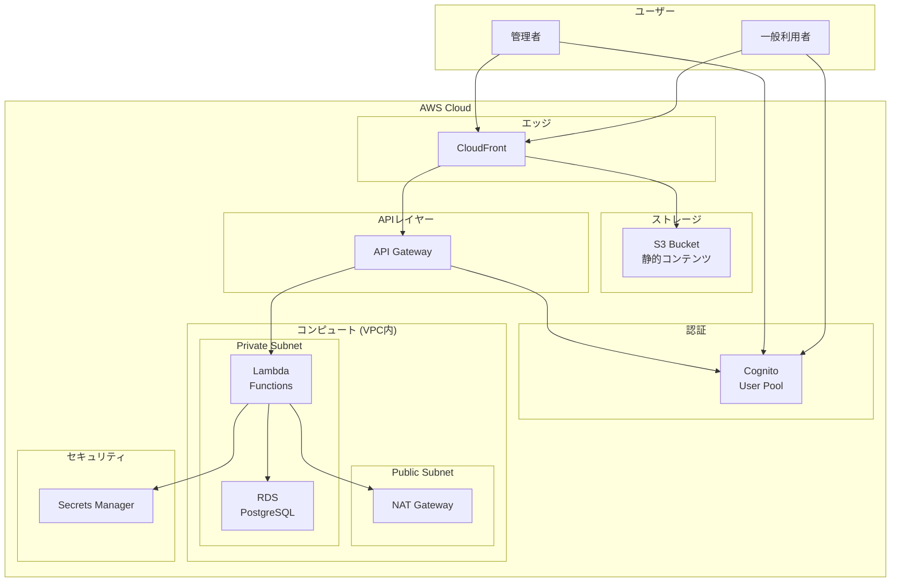
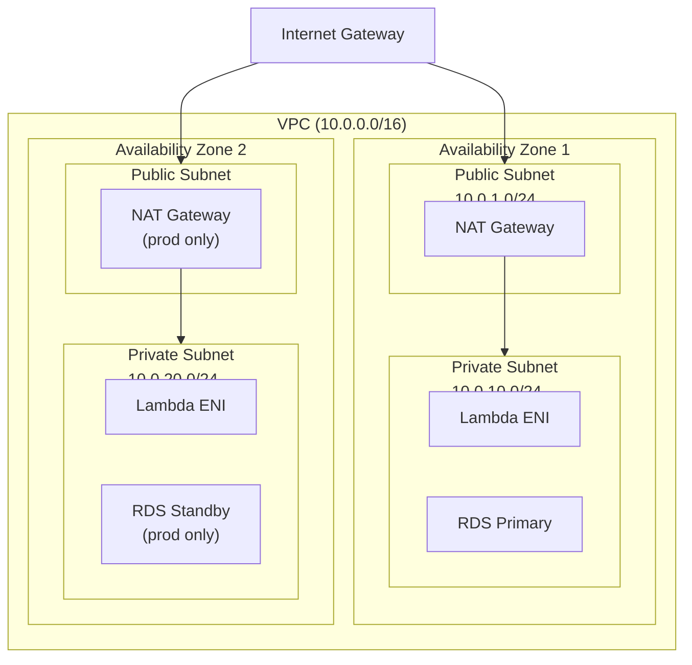
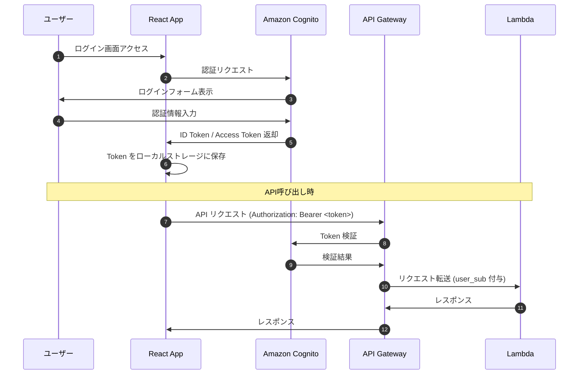
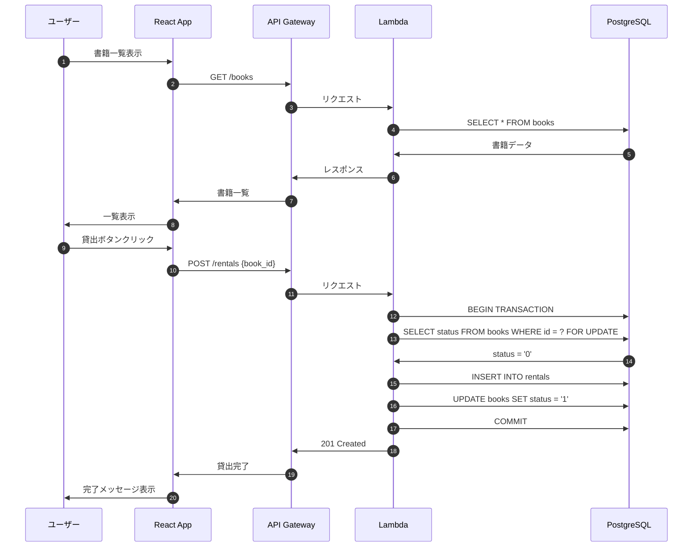
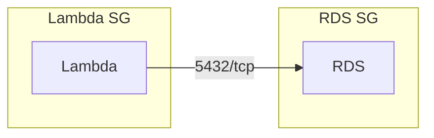
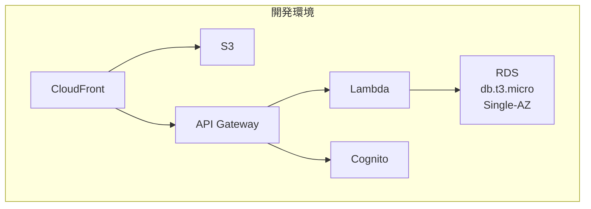
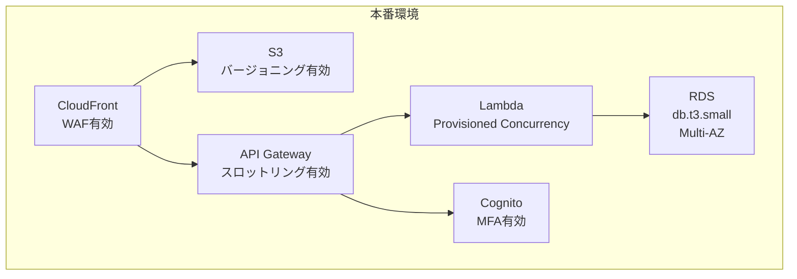
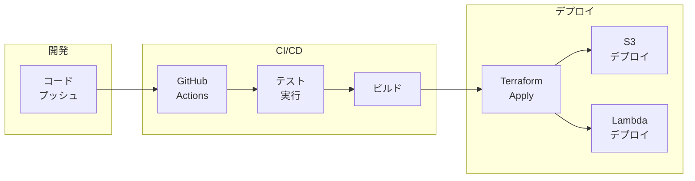

# システム構成図

本ドキュメントでは、蔵書管理システムのシステム構成を定義します。

## 1. 全体構成図

---

## 2. ネットワーク構成

---

## 3. 認証フロー

---

## 4. 貸出フロー

---

## 5. コンポーネント詳細

### 5.1 フロントエンド

| コンポーネント | 説明 |
|----------------|------|
| CloudFront | CDN。S3とAPI Gatewayへのリクエストを配信 |
| S3 | 静的ファイル（HTML/JS/CSS）をホスティング |
| React (User) | 一般利用者向けSPA（Vite + Tailwind CSS） |
| React Admin | 管理者向けSPA（React Admin） |

### 5.2 バックエンド

| コンポーネント | 説明 |
|----------------|------|
| API Gateway | REST API エンドポイント。Cognito Authorizer で認証 |
| Lambda | Python 3.12 でビジネスロジックを実行 |
| RDS PostgreSQL | 書籍・貸出データを永続化 |

### 5.3 認証・セキュリティ

| コンポーネント | 説明 |
|----------------|------|
| Cognito User Pool | ユーザー認証・管理。JWT トークン発行 |
| Secrets Manager | DB 接続情報などの機密情報を管理 |
| IAM | Lambda 実行ロール、最小権限の原則で設定 |

---

## 6. セキュリティグループ

### 6.1 Lambda セキュリティグループ

| ルール | タイプ | ポート | ソース/宛先 |
|--------|--------|--------|-------------|
| Outbound | PostgreSQL | 5432 | RDS SG |
| Outbound | HTTPS | 443 | 0.0.0.0/0 |

### 6.2 RDS セキュリティグループ

| ルール | タイプ | ポート | ソース/宛先 |
|--------|--------|--------|-------------|
| Inbound | PostgreSQL | 5432 | Lambda SG |

---

## 7. 環境別構成

### 7.1 開発環境 (dev)

| 項目 | 設定 |
|------|------|
| RDS インスタンス | db.t3.micro |
| RDS Multi-AZ | 無効 |
| Lambda メモリ | 256MB |
| CloudFront | 最小キャッシュ |

### 7.2 本番環境 (prod)

| 項目 | 設定 |
|------|------|
| RDS インスタンス | db.t3.small |
| RDS Multi-AZ | 有効 |
| Lambda メモリ | 512MB |
| Lambda Provisioned Concurrency | 2 |
| CloudFront | WAF 有効 |
| S3 | バージョニング有効 |

---

## 8. デプロイメントパイプライン

---

## 9. 監視・ログ

### 9.1 監視項目

| サービス | メトリクス | 閾値 |
|----------|------------|------|
| Lambda | Errors | > 0 |
| Lambda | Duration | > 10秒 |
| Lambda | Throttles | > 0 |
| RDS | CPUUtilization | > 80% |
| RDS | FreeStorageSpace | < 1GB |
| API Gateway | 5XXError | > 0 |
| API Gateway | Latency | > 3000ms |

### 9.2 ログ出力先

| サービス | ログ出力先 |
|----------|------------|
| Lambda | CloudWatch Logs |
| API Gateway | CloudWatch Logs |
| RDS | CloudWatch Logs (PostgreSQL) |
| CloudFront | S3 (アクセスログ) |
